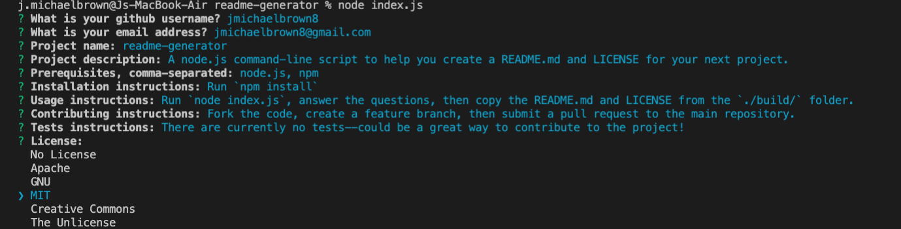

# 🖨 readme-generator

This is a command-line node script to generate a rich README.md for your next project.

## Prerequisites

* node.js
## Installation

Clone the code locally and run `npm install`

## Run

Run `node index.js` and answer the prompts to generate a README.md

## Libraries

* inquirer